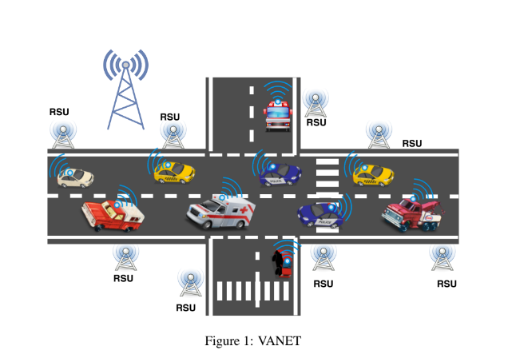

# VANET-DTMR
Distributed Tree-based Multicast Routing (DTMR) for VANET (Vehicular Adhoc Network)



### What is VANET ?  
- A vehicular ad hoc network (VANET) consists of groups of moving or stationary vehicles connected by a wireless network.  
[wikipedia](https://en.wikipedia.org/wiki/Vehicular_ad-hoc_network)

### Setting up Adhoc-Network Mode in Raspberry PI  

- To set up an ad-hoc-network interface with a static IP in raspberry pi add the following lines to the `/etc/network/interfaces` file in raspberry. This will turn the wifi interface of the raspberry into an Adhoc network interface with static IP. Through this method both ethernet and wifi interface of the pi will be accessible.

    In file /etc/network/interfaces, add the below lines
```
    auto lo
    iface lo inet loopback

    auto eth0
    iface eth0 inet dhcphttps://opensecurity.in

    auto wlan0  
    iface wlan0 inet static  
      address 10.42.43.1  
      netmask 255.255.255.0  
      wireless-channel 5  
      wireless-essid AdhocNet  
      wireless-mode ad-hoc 
```
This will create an ad-hoc setup with username AdhocNet and IP 10.42.43.1. Change the IP accordingly
